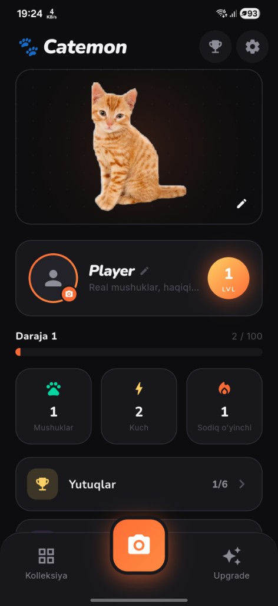
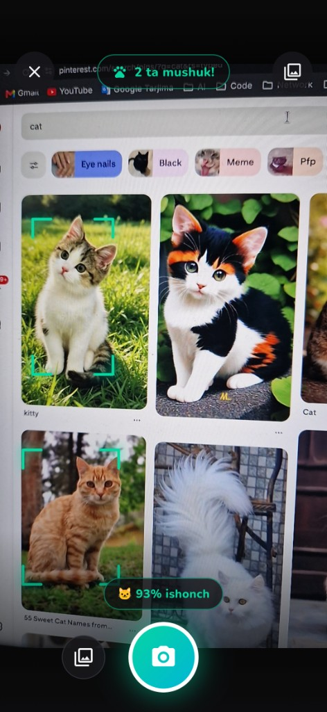
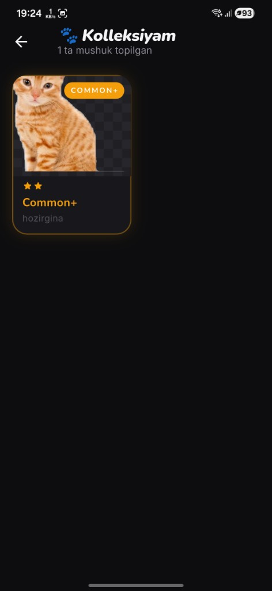
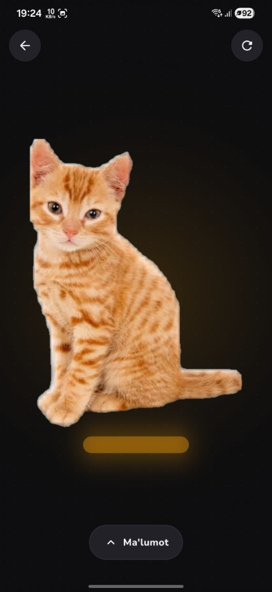
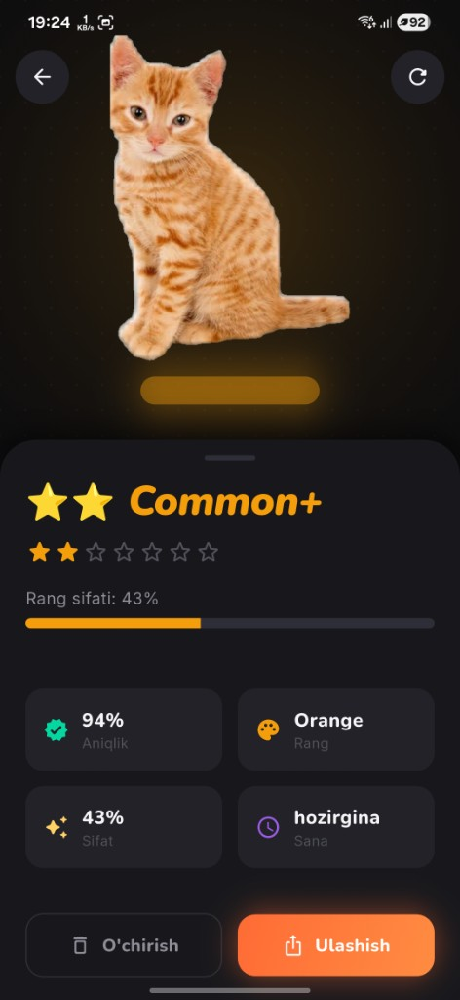
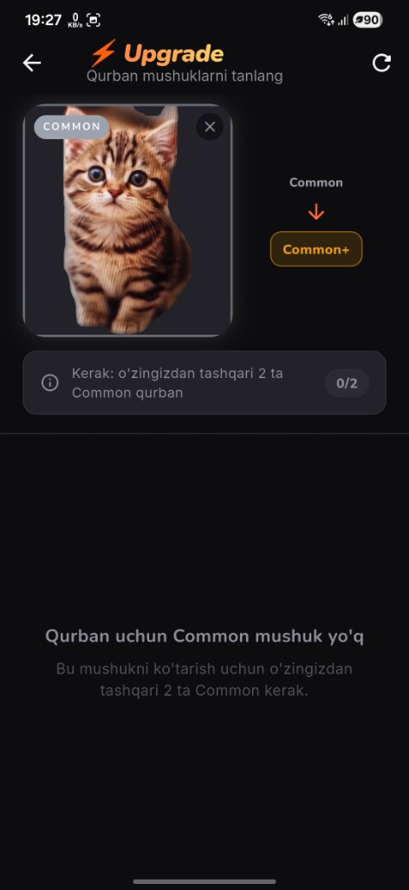
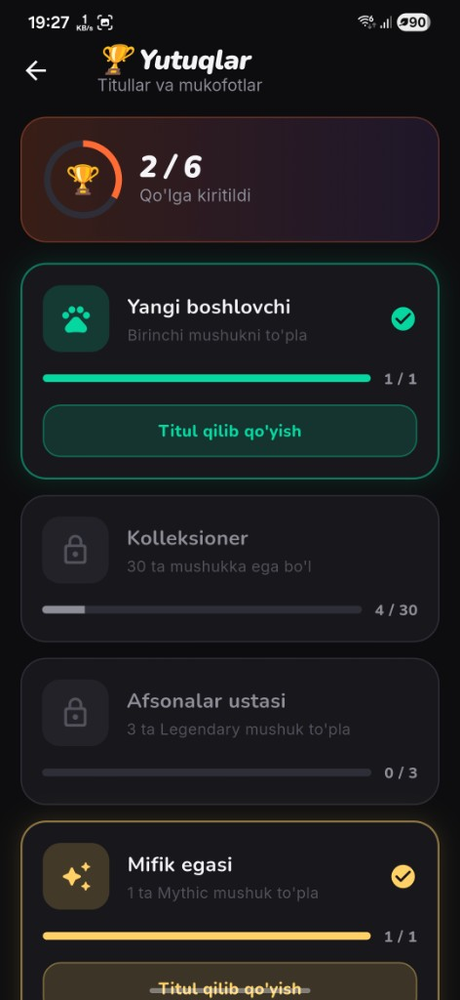
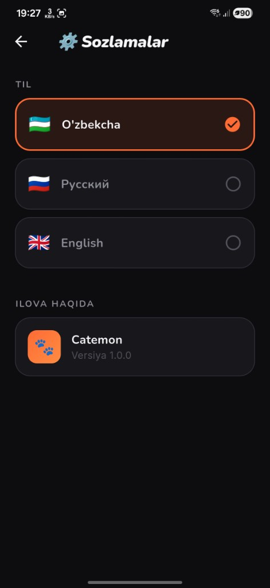

<p align="center">
  
</p>

<h1 align="center">🐾 Catemon</h1>

<p align="center">
  <strong>Discover real cats. Build your collection. Level up your profile.</strong>
</p>

<p align="center">
  Flutter mobile game with on-device YOLO segmentation — detect cats, save transparent cutouts, grade rarity, and grow your collection.
</p>

<p align="center">
  
  
  
</p>

---

## Home & Profile


Your player hub: edit name and avatar, set a showcase cat, track level, power, and login streak. Bottom nav opens Collection, Camera, and Upgrade.

---

## Live Detection



Point the camera at a cat. After 2 confirmed frames, tap capture to save a segmented cutout. You can also pick an image from the gallery.

---

## Collection



Grid of all saved cats with rarity badges and dates. Tap to view, long-press to delete.

---

## Cat Viewer (Fullscreen)



Swipe down on the panel to view the cat fullscreen. Drag to rotate, pinch to zoom.

---

## Cat Details



Swipe up to see rarity, accuracy, coat color, quality, and capture date.

---

## Upgrade



Pick a cat to upgrade, then sacrifice others of the same tier. The target cat is kept; sacrifices are consumed.

| From | To | Sacrifices |
|------|----|------------|
| Common | Common+ | 2 |
| Common+ | Uncommon | 2 |
| Uncommon | Rare | 2 |
| Rare | Epic | 3 |
| Epic | Legendary | 3 |
| Legendary | Mythic | 4 |

---

## Achievements



Six unlockable titles (first cat, 30 cats, 3 Legendary, 1 Mythic, level 10, 7-day streak). Earned titles stay forever.

---

## Settings



Switch between Uzbek, Russian, and English. Changes apply instantly.

---

## Getting Started

```bash
cd cat_detector_app
flutter pub get
flutter run
```

## Build APK

```bash
cd cat_detector_app
flutter build apk --release
# → build/app/outputs/flutter-apk/app-release.apk
```

---

<p align="center">
  Made with 🐾 and Flutter · <strong>Catemon v1.0.0</strong>
</p>
